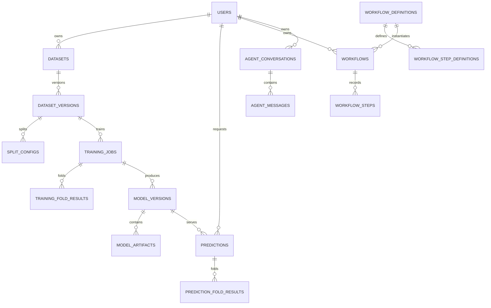

# 18. ERD

```mermaid
erDiagram
 USERS ||--o{ DATASETS : owns
 DATASETS ||--o{ DATASET_VERSIONS : versions
 DATASET_VERSIONS ||--o{ SPLIT_CONFIGS : splits
 DATASET_VERSIONS ||--o{ TRAINING_JOBS : trains
 TRAINING_JOBS ||--o{ TRAINING_FOLD_RESULTS : folds
 TRAINING_JOBS ||--o{ MODEL_VERSIONS : produces
 MODEL_VERSIONS ||--o{ MODEL_ARTIFACTS : contains
 USERS ||--o{ PREDICTIONS : requests
 MODEL_VERSIONS ||--o{ PREDICTIONS : serves
 PREDICTIONS ||--o{ PREDICTION_FOLD_RESULTS : folds
 USERS ||--o{ WORKFLOWS : owns
 WORKFLOW_DEFINITIONS ||--o{ WORKFLOW_STEP_DEFINITIONS : defines
 WORKFLOW_DEFINITIONS ||--o{ WORKFLOWS : instantiates
 WORKFLOWS ||--o{ WORKFLOW_STEPS : records
 USERS ||--o{ AGENT_CONVERSATIONS : owns
 AGENT_CONVERSATIONS ||--o{ AGENT_MESSAGES : contains
```
